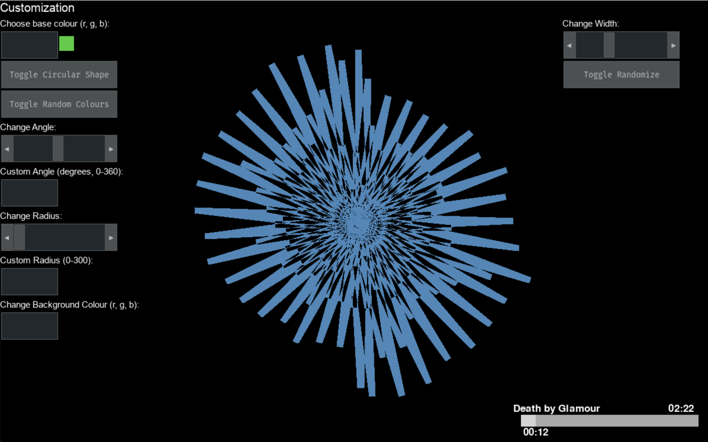
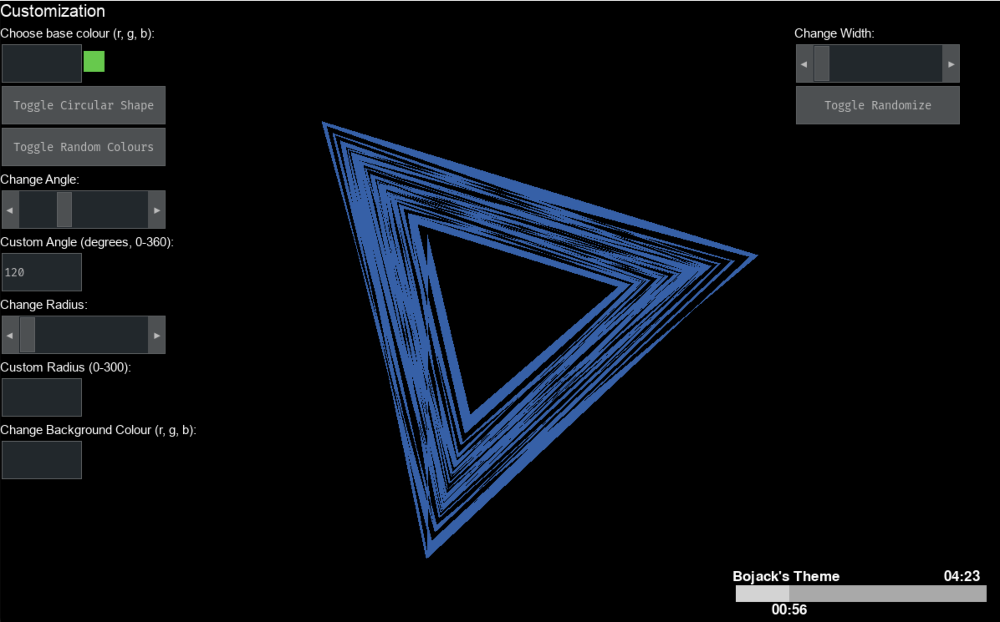
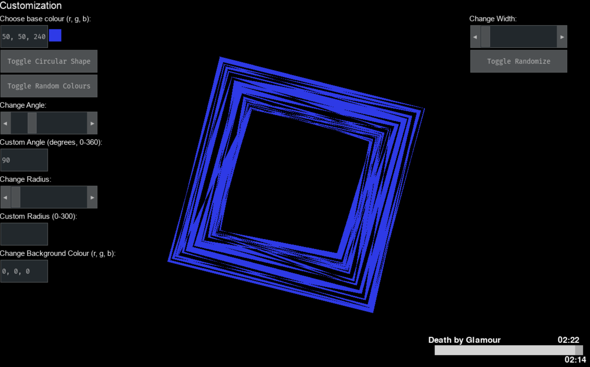
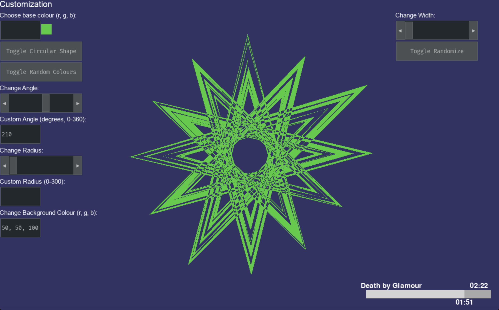
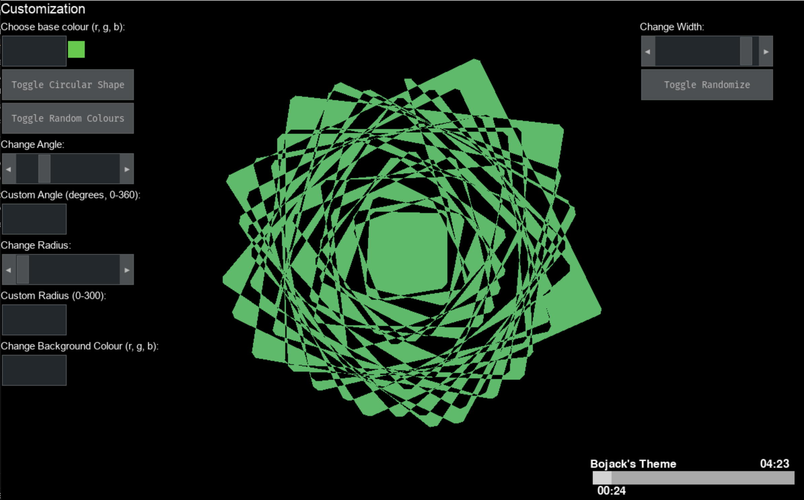

# Audio-Visualizer
An audio visualizer that displays cool and unique patterns in sync to your music!

Created with python, using librosa for the audio analysis and pygame for the visuals.

# How to Use
1. Download this repository to your computer (click the green 'code' button and click download zip)
2. Open terminal/command prompt and cd into the repo
3. Type: "pip3 install -r requirements.txt" (or 'pip' if 'pip3' doesn't work)
4. Then type "python main.py" (you may have to install python if this doesn't work)

You should be prompted to choose a file. You must select a .wav file (other file types might work such as .flac and .ogg, but are untested. mp3 will not work) from anywhere on your computer.
The python window might not be in the foreground automatically, so if you hear the music but you don't see anything, just make sure to click on the python app that's running.

Press 'h' on your keyboard to hide the settings.

To change the song, simply close the program (press 'q') and relaunch it.

# Customization
There are pleny of customization options on the left. If you are unsure what they do, feel free to mess around with them until you find something you like!

For the colours, the format is r, g, b. E.g: "32, 10, 115" (without the quotes). Inputting anything else simply won't do anything.

The "Toggle Randomize" button will randomize all the settings in sync with the music.

The "Toggle Random Colours" will enable/disable the random colour switching in sync with the music (is enabled by default)

Each time you run the program, each of the options will be randomized.

# Getting .wav Files
There are a few songs that come with the repository ("Bojack's Theme" by Patrick and Ralph Carney, "Death by Glamour" by Toby Fox, and an original song I made), but if you want to use your own, I recommend finding your song on YouTube, and then using a YouTube to WAV converter. This one works well: https://y2down.cc/en/youtube-wav.html

If you have an mp3 (or any other music file type) that you want to convert to a WAV file, this website works great: https://cloudconvert.com/mp3-to-wav

# Previews

